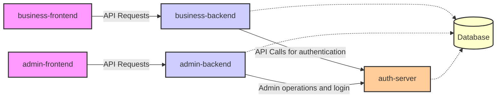
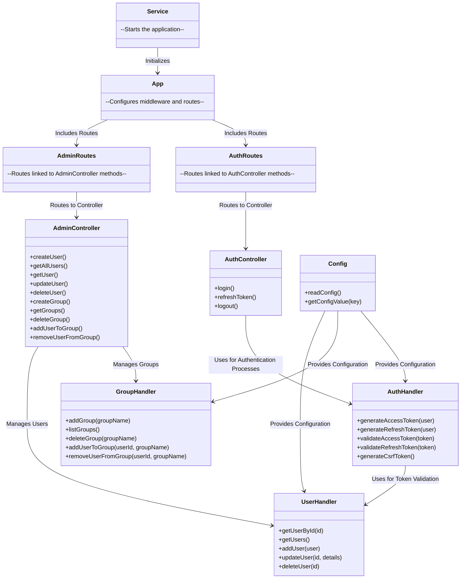

# Auth Server

## Architektue

```mermaid
graph LR
    BF[business-frontend] -- "API Requests" --> BB[business-backend]
    AF[admin-frontend] -- "API Requests" --> AB[admin-backend]
    BB -- "API Calls for authentication" --> AS[auth-server]
    AB -- "Admin operations and login" --> AS

    BB -.-> DB[(Database)]
    AB -.-> DB[(Database)]
    AS -.-> DB[(Database)]

    classDef frontend fill:#f9f,stroke:#333,stroke-width:2px;
    classDef backend fill:#ccf,stroke:#333,stroke-width:2px;
    classDef database fill:#ffc,stroke:#333,stroke-width:2px;
    classDef auth fill:#fc9,stroke:#333,stroke-width:2px;

    class BF,AF frontend;
    class BB,AB backend;
    class AS auth;
    class DB database;
```

## Översikt

```mermaid
classDiagram
    class UserHandler {
        +getUserById(id)
        +getUsers()
        +addUser(user)
        +updateUser(id, details)
        +deleteUser(id)
    }

    class GroupHandler {
        +addGroup(groupName)
        +listGroups()
        +deleteGroup(groupName)
        +addUserToGroup(userId, groupName)
        +removeUserFromGroup(userId, groupName)
    }

    class AuthHandler {
        +generateAccessToken(user)
        +generateRefreshToken(user)
        +validateAccessToken(token)
        +validateRefreshToken(token)
        +generateCsrfToken()
    }

    class AdminController {
        +createUser()
        +getAllUsers()
        +getUser()
        +updateUser()
        +deleteUser()
        +createGroup()
        +getGroups()
        +deleteGroup()
        +addUserToGroup()
        +removeUserFromGroup()
    }

    class AuthController {
        +login()
        +refreshToken()
        +logout()
    }

    class AdminRoutes {
        --Routes linked to AdminController methods--
    }

    class AuthRoutes {
        --Routes linked to AuthController methods--
    }

    class Config {
        +readConfig()
        +getConfigValue(key)
    }

    class Service {
        --Starts the application--
    }

    class App {
        --Configures middleware and routes--
    }

    %% Linking modules
    AuthHandler --> UserHandler : Uses for Token Validation
    AdminController --> UserHandler : Manages Users
    AdminController --> GroupHandler : Manages Groups
    AuthController --> AuthHandler : Uses for Authentication Processes
    AdminRoutes --> AdminController : Routes to Controller
    AuthRoutes --> AuthController : Routes to Controller
    Service --> App : Initializes
    Config --> UserHandler : Provides Configuration
    Config --> GroupHandler : Provides Configuration
    Config --> AuthHandler : Provides Configuration
    App --> AdminRoutes : Includes Routes
    App --> AuthRoutes : Includes Routes
```
