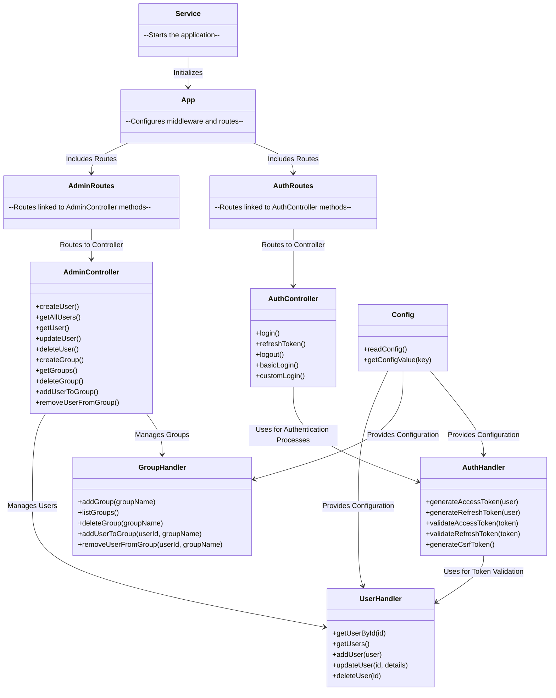

# Auth Server

## Översikt

```mermaid
classDiagram
    class UserHandler {
        +getUserById(id)
        +getUsers()
        +addUser(user)
        +updateUser(id, details)
        +deleteUser(id)
    }

    class GroupHandler {
        +addGroup(groupName)
        +listGroups()
        +deleteGroup(groupName)
        +addUserToGroup(userId, groupName)
        +removeUserFromGroup(userId, groupName)
    }

    class AuthHandler {
        +generateAccessToken(user)
        +generateRefreshToken(user)
        +validateAccessToken(token)
        +validateRefreshToken(token)
        +generateCsrfToken()
    }

    class AdminController {
        +createUser()
        +getAllUsers()
        +getUser()
        +updateUser()
        +deleteUser()
        +createGroup()
        +getGroups()
        +deleteGroup()
        +addUserToGroup()
        +removeUserFromGroup()
    }

    class AuthController {
        +login()
        +refreshToken()
        +logout()
        +basicLogin()
        +customLogin()
    }

    class AdminRoutes {
        --Routes linked to AdminController methods--
    }

    class AuthRoutes {
        --Routes linked to AuthController methods--
    }

    class Config {
        +readConfig()
        +getConfigValue(key)
    }

    class Service {
        --Starts the application--
    }

    class App {
        --Configures middleware and routes--
    }

    %% Linking modules
    AuthHandler --> UserHandler : Uses for Token Validation
    AdminController --> UserHandler : Manages Users
    AdminController --> GroupHandler : Manages Groups
    AuthController --> AuthHandler : Uses for Authentication Processes
    AdminRoutes --> AdminController : Routes to Controller
    AuthRoutes --> AuthController : Routes to Controller
    Service --> App : Initializes
    Config --> UserHandler : Provides Configuration
    Config --> GroupHandler : Provides Configuration
    Config --> AuthHandler : Provides Configuration
    App --> AdminRoutes : Includes Routes
    App --> AuthRoutes : Includes Routes
```
